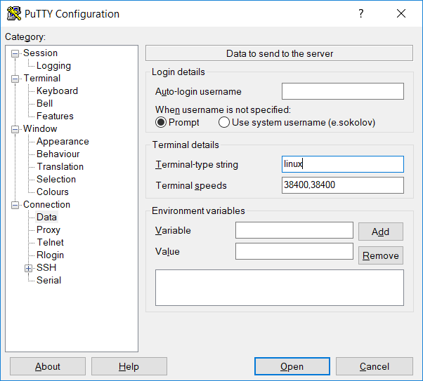
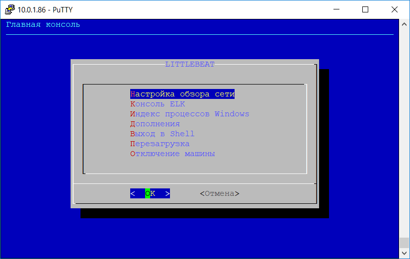

# LittleBeat
Это готовый к работе аплаенс для сбора и анализа журналов событий Windows на базе стека ELK, предназначенный для небольших компаний (от 5 до 500 хостов).  

## Требования к системе 

Виртуальная или физическая машина Ubuntu Server 16.04 LTS.   
Минимально необходимо 4 процессорных ядра, 8 GB RAM, 100 GB HDD. Если вы хотите хранить логи долго, дисковый массив должен быть больше. Объем диска считайте по формуле (к-во хостов)*(к-во дней)*0.02 GB. В качестве процессора годится даже Intel Atom. То есть, китайский barebone вполне подойдет для малых сетей (до 100 хостов). Для сетей побольше, лучше иметь настоящий сервер. Физическая машина, как понятно, предпочтительнее виртуальной в производительности. Для больших сетей, рекомендуется больше оперативной памяти на сервере. Вплоть до 16 GB.

Рекомендуется минимальная установка системы с дистрибутива, с выбором только сервера SSH и стандартных системных утилит, в качестве дополнительных опций. 

Рекомендуется статическая настройка IP или фиксация адреса на сервере DHCP.

Обязательно иметь в сети сервер DNS. Эту функцию может выполнять домашний WiFi Router. 

В DNS обязательно должна быть внесена запись с адресом хоста littlebeat (так и должен называться).

Рекомендуется иметь в DNS настроенные записи PTR для хостов, но это не обязательно. 

Во время установки необходим доступ в Интернет. Как к репозиториям Ubuntu и Elastic, так и к GitHub.

Коммуникации между агентами и сервером закрываются посредством SSL. Используется самоподписанный сертификат сервера, который создается в процессе установки и конфигурации аплаенса.  

Более подробная документация на [LittleBeat.wiki](https://github.com/ESGuardian/LittleBeat/wiki)

## Установка

Во время установки на вашем сервере будет создан пользователь `little` (пароль вы зададите сами). Этому пользователю будут заданы uid=0 и gid=0, то есть он станет рутом

Предпочтительно использовать PuTTy в качестве SSH консоли. Поскольку все скрипты используют утилиту dialog и псевдографику, чтобы она не выглядела смещно, необходимо в PuTTy для сессии с littlebeat вписать значение "linux" для параметра "Terminal-type-string", как показано на картинке:



Подключитесь к консоли вашего сервера и заделайтесь рутом (sudo su). Введите команды:
```
sudo su
cd /tmp
wget https://raw.githubusercontent.com/ESGuardian/LittleBeat/v-6.1.001/run.sh
bash run.sh
```
Далее следуйте инструкциям на экране. 

После выполнения маленького скрипта машина перезагрузится. Повторно подключитесь к серверу указав имя пользователя "little' и пароль, который придумали и задали на предыдущем этапе. Увидите меню установки и настройки системы.

Установка не полностью автоматическая. В двух местах необходимо вводить пароли создаваемых пользователей. В разных местах надо нажимать кнопочку "Ок". Больше  ничего особенного делать не надо.

Ах, да. После установки всей системы рекомендуется настроить и запустить обзор локальной сети утилитой nmap. Это делается в меню, которое появится в конце установки. 



В дальнейшем при подключении к консоли аплаенса от имени пользователя "little" вы всегда будете видеть это меню.

В браузере на своей рабочей машине заходите на `https://littlebeat/`.

Более подробная документация на [LittleBeat.wiki](https://github.com/ESGuardian/LittleBeat/wiki)

## История версий
Это версия 6.1.001 она является результатом переноса на ELK 6.1.3 версии LittleBeat 5.5.001. Поскольку в новой версии ёлки произошли очень большие изменения, простого способа апгрейда с версии 5.5 нет. Кроме того многое изменилось в дизайне системы. Например я сделал msi файлы для установки агентов winlogbeat. Это позволяет разворачивать их групповыми политиками.

Это рабочая стабильная версия. Изменения будут вноситься только в файлы документации и еще появится новый Wazuh Addon (возможны и другие дополнения).


esguardian@outlook.com
